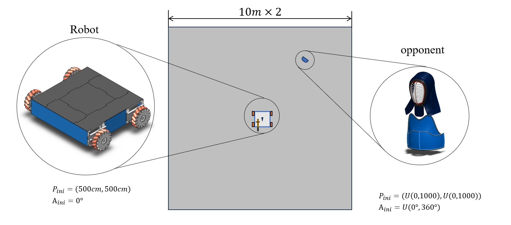
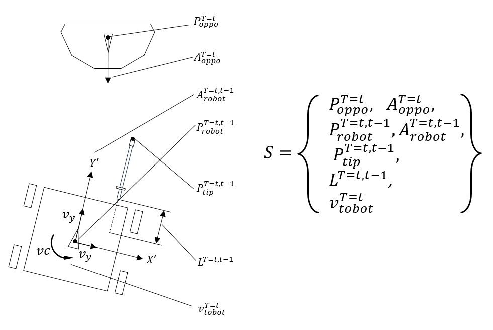
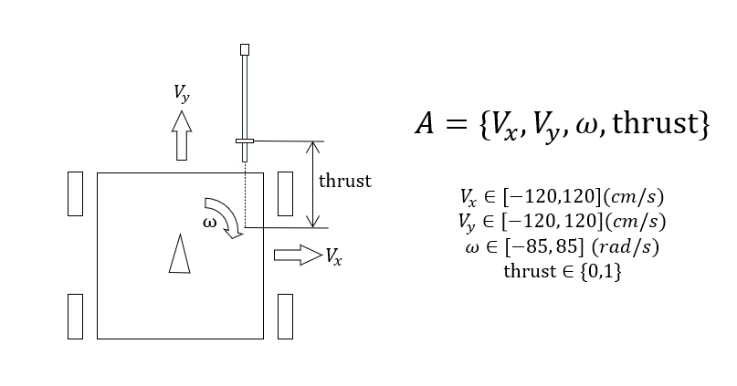
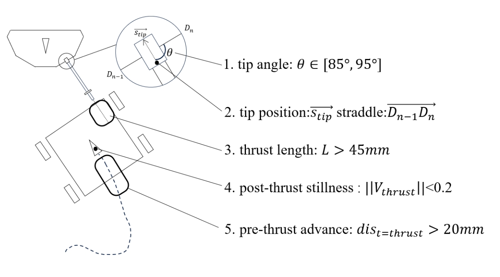
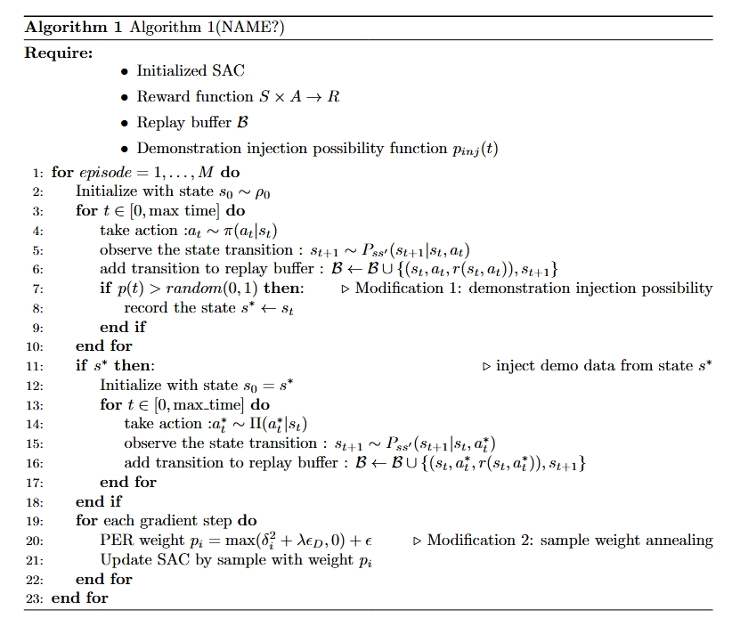
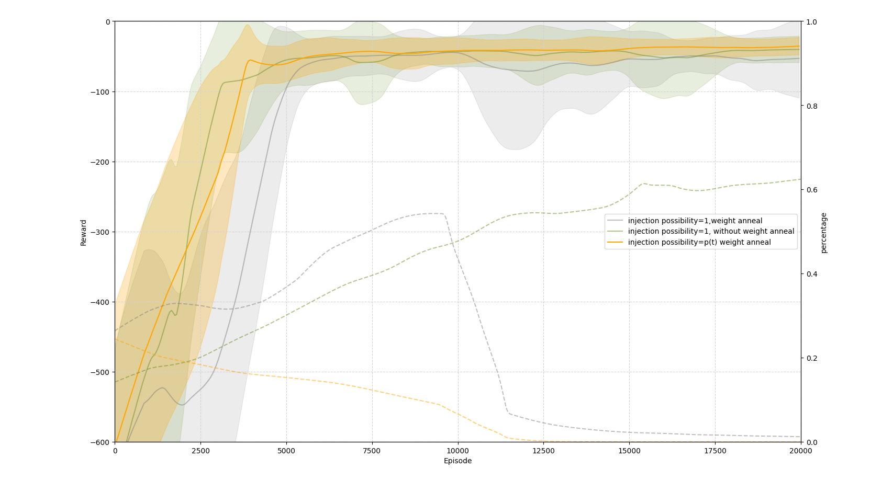
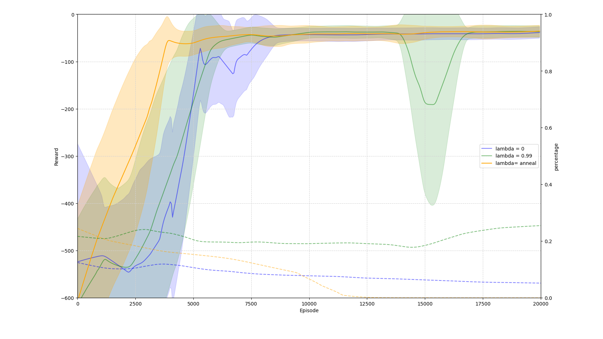
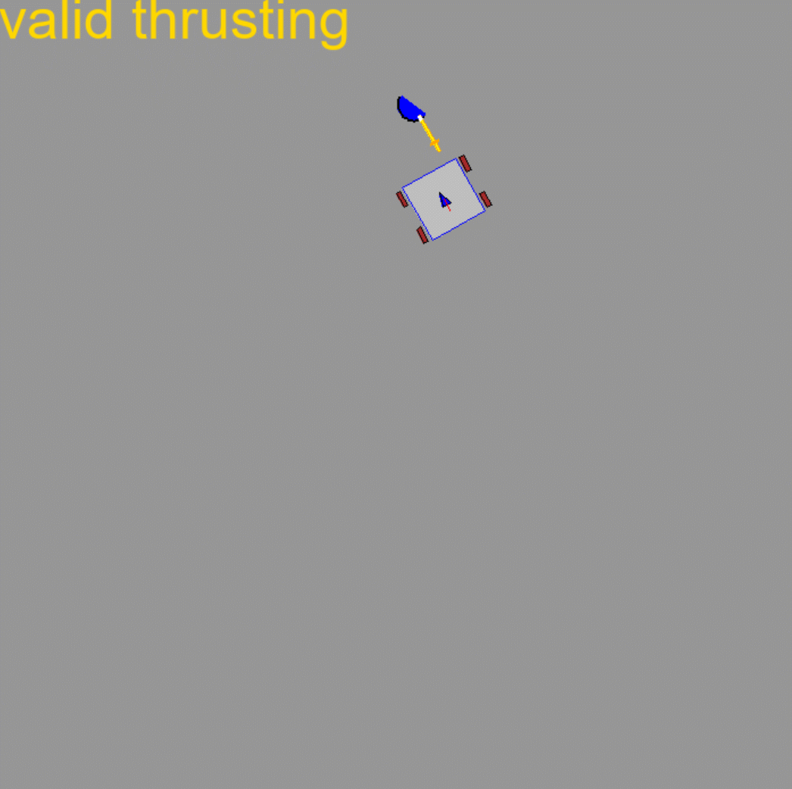

# Task:

manipulate robot to conduct a valid thrust toward opponent

### Initialize Dojo_env

### State Space

$dim(S) = 16$

### Action Space

$dim(A) = 4$

### vaild thrust judgment

In order to restore the rules and manner of tankendo as closely as possible, a vaild thrust is defined as follows:

### Reward function(Sparse)

One of the challenges of the topic is to use only sparse reward functions:
$$
r = \cases
{
0,& \text{if done}\\
-1,& \text{else}
}
$$
In particular, we give more negative reward on several harmful states. 

$$
r \text{+=} \cases
{
-3,& \text{invalid thrust}\\
-2,& \text{collision}\\
-2,& \text{outrange}
}
$$

### Demonstration from rule-based model

​	Another major challenge is the difficulty in collecting human expert data. The main idea of the project is to use non-optimal rule-base demonstrations to provide early assistance in training.

​	the model is to define several sets of points that are not included in the observable part of the state space. The agent will be guided to the thrust point, sprint straight, and finally stop at the stop point to complete the thrust.

​	Without adding noise, the success rate is **32.5%**, and with adding noise, the success rate is **17.2%**

# method：

### backbone:

SAC with PER， a modified version from：https://github.com/BY571/Soft-Actor-Critic-and-Extensions

### pseudo code (#ToBeNamed)

### accumulate reward (#ModifyFont)

The proposed method is shown in orange.

### render

The learning success rate is **94.06%** when using the **17.2%** non-optimal demonstrations.

The remaining parameters, overfitting analysis as well as extended experiments will be further mentioned in the paper(#TODO).

